# Домашнее задание к занятию «Отказоустойчивость в облаке» Шелухин Юрий

### Чеклист готовности к домашнему заданию

1. Создан аккаунт на YandexCloud.  
2. Создан новый OAuth-токен.  
3. Установлено программное обеспечение  Terraform.   

### Инструменты и дополнительные материалы, которые пригодятся для выполнения задания

1. [Документация сетевого балансировщика нагрузки](https://cloud.yandex.ru/docs/network-load-balancer/quickstart)

 ---

## Задание 1 
Возьмите за основу [решение к заданию 1 из занятия «Подъём инфраструктуры в Яндекс Облаке»](https://github.com/netology-code/sdvps-homeworks/blob/main/7-03.md#задание-1).

1. Теперь вместо одной виртуальной машины сделайте terraform playbook, который:

- создаст 2 идентичные виртуальные машины. Используйте аргумент [count](https://www.terraform.io/docs/language/meta-arguments/count.html) для создания таких ресурсов;
- создаст [таргет-группу](https://registry.terraform.io/providers/yandex-cloud/yandex/latest/docs/resources/lb_target_group). Поместите в неё созданные на шаге 1 виртуальные машины;
- создаст [сетевой балансировщик нагрузки](https://registry.terraform.io/providers/yandex-cloud/yandex/latest/docs/resources/lb_network_load_balancer), который слушает на порту 80, отправляет трафик на порт 80 виртуальных машин и http healthcheck на порт 80 виртуальных машин.

2. Установите на созданные виртуальные машины пакет Nginx любым удобным способом и запустите Nginx веб-сервер на порту 80.

3. Перейдите в веб-консоль Yandex Cloud и убедитесь, что: 

- созданный балансировщик находится в статусе Active,
- обе виртуальные машины в целевой группе находятся в состоянии healthy.

4. Сделайте запрос на 80 порт на внешний IP-адрес балансировщика и убедитесь, что вы получаете ответ в виде дефолтной страницы Nginx.

*В качестве результата пришлите:*
*1. Terraform Playbook.*
*2. Скриншот статуса балансировщика и целевой группы.*
*3. Скриншот страницы, которая открылась при запросе IP-адреса балансировщика.*

---

### Решение 1.
1. Установим Terraform    
`sudo snap install terraform --classic`
 
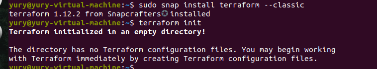      

2. Создадим плейбук. Установим Nginx путем передачи в Terraform  параметров с помощью #cloud-config в файле metadata.yaml. Ключ от сервисного аккаунта укажем в отдельном файле. 
   
`   terraform {
  required_providers {
    yandex = {
      source = "yandex-cloud/yandex"
    }
  }
  required_version = ">= 0.13"
}` 

`provider "yandex" {
  service_account_key_file = "/home/yury/key.json" 
  cloud_id                 = "b1ge6ksn8gkr97asu03a"
  folder_id                = "b1gsn46kdu9vi56ievnv"
  zone      = "ru-central1-b"
}`  
Весь плейбук в приложенном файле
#### Конфигурационные файлы.  
[плейбук](files/main1.tf)  
[cloud-config](files/metadata.yaml)

3. Запустим Terraform, проверим создание виртуальных машин и балансирощика, сделаем запрос на порт 80 балансирощика, убедимся,что работает Nginx.  
`terraform validate`  
`terraform init`    
`terraform apply`    
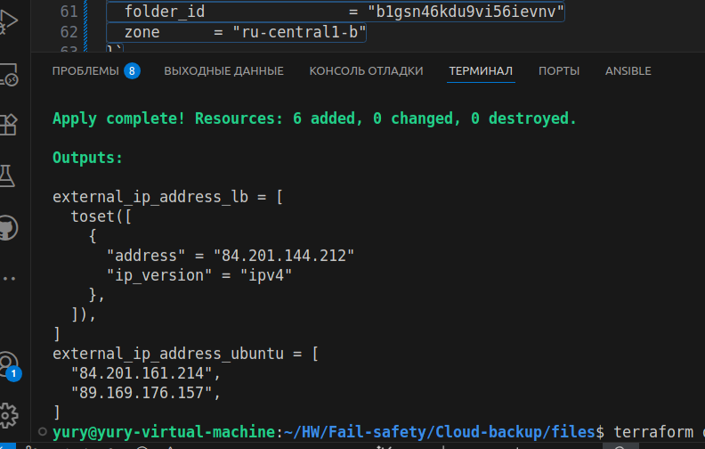
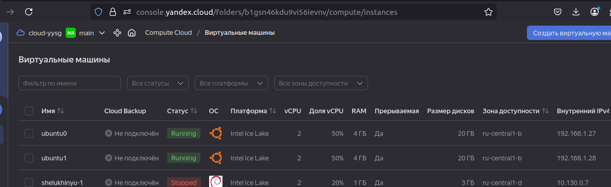
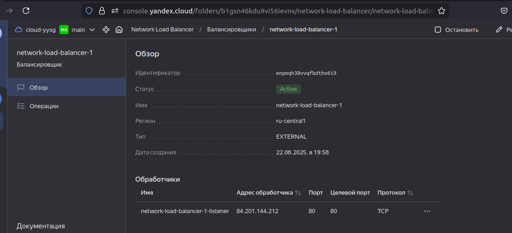
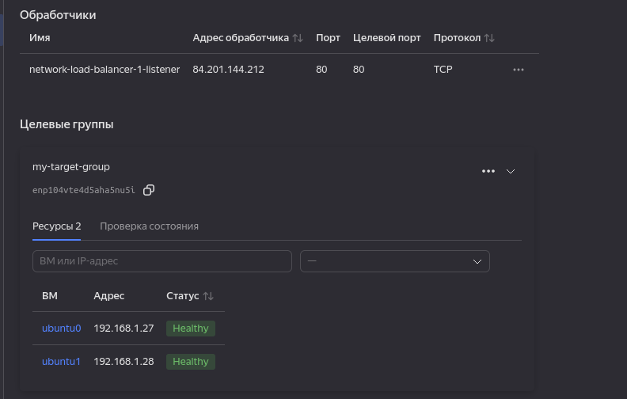
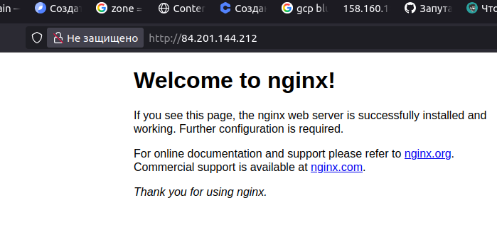  
  
`terraform destroy`  

---

## Задание 2*
1. Теперь вместо создания виртуальных машин создайте [группу виртуальных машин с балансировщиком нагрузки](https://cloud.yandex.ru/docs/compute/operations/instance-groups/create-with-balancer).

2. Nginx нужно будет поставить тоже автоматизированно. Для этого вам нужно будет подложить файл установки Nginx в user-data-ключ [метадаты](https://cloud.yandex.ru/docs/compute/concepts/vm-metadata) виртуальной машины.

- [Пример файла установки Nginx](https://github.com/nar3k/yc-public-tasks/blob/master/terraform/metadata.yaml).
- [Как подставлять файл в метадату виртуальной машины.](https://github.com/nar3k/yc-public-tasks/blob/a6c50a5e1d82f27e6d7f3897972adb872299f14a/terraform/main.tf#L38)

3. Перейдите в веб-консоль Yandex Cloud и убедитесь, что: 

- созданный балансировщик находится в статусе Active,
- обе виртуальные машины в целевой группе находятся в состоянии healthy.

4. Сделайте запрос на 80 порт на внешний IP-адрес балансировщика и убедитесь, что вы получаете ответ в виде дефолтной страницы Nginx.

*В качестве результата пришлите*
*1. Terraform Playbook.*
*2. Скриншот статуса балансировщика и целевой группы.*
*3. Скриншот страницы, которая открылась при запросе IP-адреса балансировщика.*

---

### Решение 2*.
1. Создадим плейбук и файл и файл метаданных. 
 
#### Конфигурационные файлы.  
[плейбук](files/main2.tf)  
[cloud-config](files/metadata.yaml)

2. Запустим Terraform, проверим создание виртуальных машин и балансирощика, сделаем запрос на порт 80 балансирощика, убедимся,что работает Nginx.    

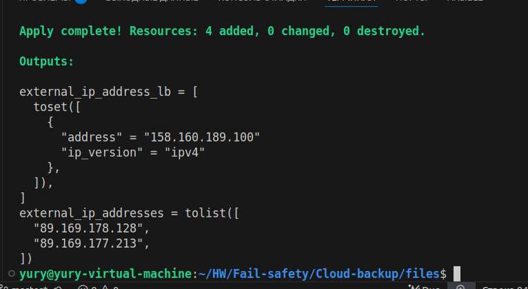
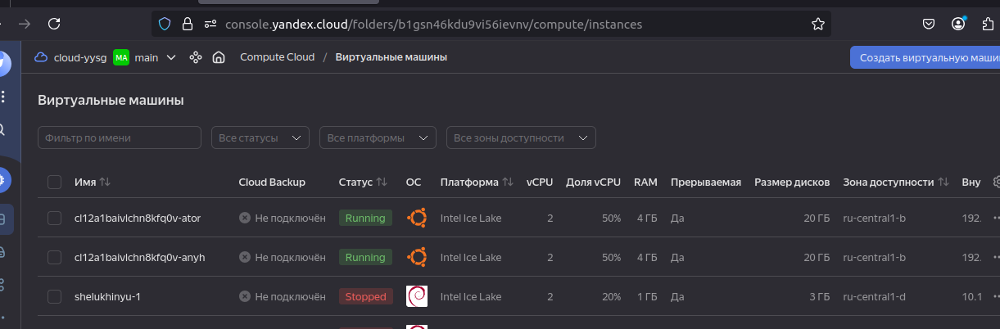
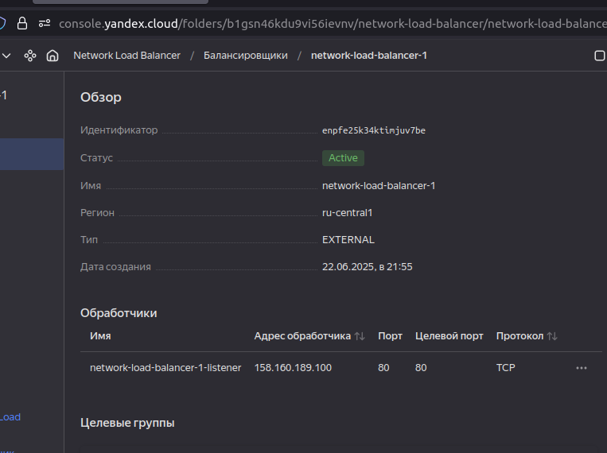
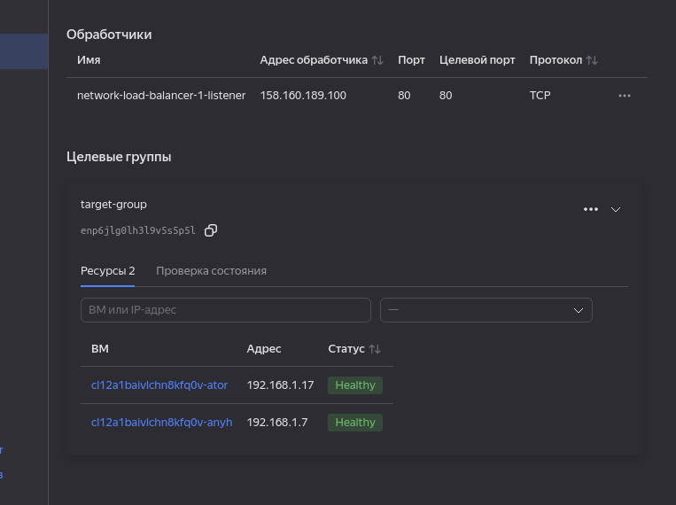
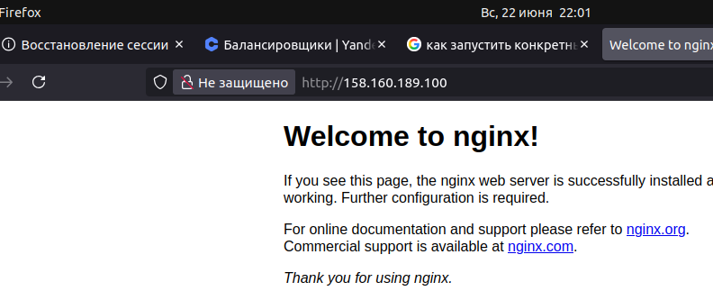
  

---
